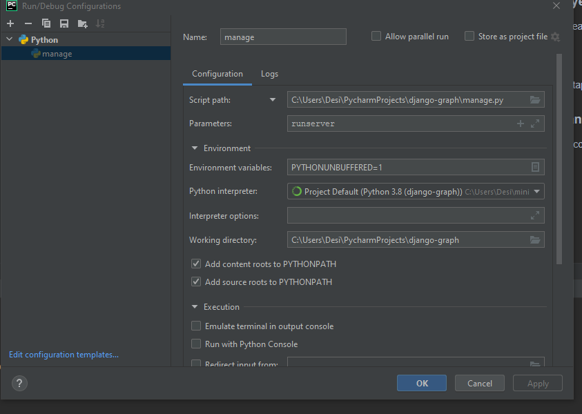

# django-graph

Vitrualenv con conda y 3.8

### Crear nuevo proyecto Django
(El punto es para no crear carpetas extra)

    django-admin startproject movies .

### Crear nueva app
    python manage.py startapp api

### Configurar el manage.py desde pycharm
Ejecutar el manage.py con el botón secundario y run. Editar la configuración
y ponerle el parámetro runserver.

### Aplicar migraciones
    python manage.py migrate

### Crear el superuser
    python manage.py createsuperuser

## Documentación
Models: https://docs.djangoproject.com/en/3.2/topics/db/models/
Graphene django: https://docs.graphene-python.org/projects/django/en/latest/